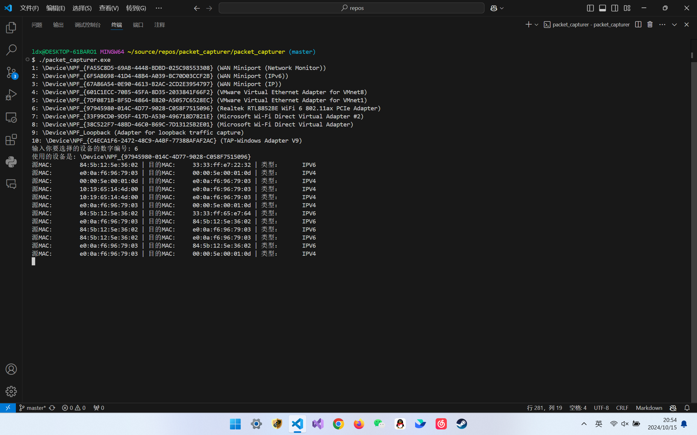

# 实验报告

#### 2213601李丁新 2024/10/15

## 实验目的

1. 了解NPcap的架构。
2. 学习NPcap的设备列表获取方法、网卡设备打开方法，以及数据包捕获方法。
3. 通过NPcap编程，实现本机的数据包捕获，显示捕获数据帧的源MAC地址和目的MAC地址，以及类型/长度字段的值。
4. 捕获的数据包不要求硬盘存储，但应以简单明了的方式在屏幕上显示。必显字段包括源MAC地址、目的MAC地址和类型/长度字段的值。
5. 编写的程序应结构清晰，具有较好的可读性。

## 前期准备

#### 安装NPcap依赖

从[NPcap官网下载页面](https://npcap.com/#download/)下载[NPcap SDK 1.13](https://npcap.com/dist/npcap-sdk-1.13.zip)压缩包，解压缩

#### 配置Makefile参数

1. 在Makefile中编译器参数中添加NPcap头文件地址：`CXXFLAGS = -Wall -Wextra -std=c++11 -I"C:\Program Files\Npcap\Include"`
2. 在Makefile中链接器参数中添加NPcap库文件地址和需要的库文件：`LDFLAGS = -L"C:\Program Files\Npcap\Lib\x64" -lPacket -lwpcap -lws2_32`

#### 以太网帧结构

| 字段          | 长度    |
| ------------- | ------- |
| 目的MAC地址   | 6字节   |
| 源MAC地址     | 6字节   |
| 以太网类型    | 2字节   |
| 数据          | 46-1500字节 |
| 帧校验序列（FCS） | 4字节   |

## 代码解析

#### 导入头文件

```cpp
#include <iomanip>
#include <iostream>
#include <pcap.h>
#include <string>
#include <vector>
#include <windows.h>
#include <winsock2.h>
#include <ws2tcpip.h>
```

#### 定义帧数据结构

定义数据结构对应以太帧和IP首部结构，方便信息的提取

```cpp
// 帧首部结构
typedef struct FrameHeader_t {
    u_char DesMAC[6];  // 目的地址
    u_char SrcMAC[6];  // 源地址
    u_short FrameType; // 帧类型或长度
} FrameHeader_t;

// IP首部结构
typedef struct IPHeader_t {
    u_char Ver_HLen;      // 版本 (4 bits) + 首部长度 (4 bits)
    u_char TOS;           // 服务类型
    u_short TotalLen;     // 总长度
    u_short ID;           // 标识
    u_short Flag_Segment; // 标志 (3 bits) + 片偏移 (13 bits)
    u_char TTL;           // 生存时间
    u_char Protocol;      // 协议
    u_short Checksum;     // 首部校验和
    u_long SrcIP;         // 源地址
    u_long DstIP;         // 目的地址
} IPHeader_t;

// 包含帧首部和IP首部的数据包结构
typedef struct Data_t {
    FrameHeader_t FrameHeader;
    IPHeader_t IPHeader;
} Data_t;
```

#### 定义PacketCapturer类

定义数据包处理器类

```cpp
class PacketCapturer {
  public:
    PacketCapturer() : handle(nullptr), alldevs(nullptr), device(nullptr) {}

    ~PacketCapturer() {
        if (handle) {
            pcap_close(handle);
        }
        if (alldevs) {
            pcap_freealldevs(alldevs);
        }
    }
```

##### 选择设备部分

1. 通过`pcap_findalldevs()`找出设备的全部网络设备，将设备名存入`device_names`备用，将设备名带编号打印到控制台供用户选择
2. 监听用户输入并根据输入选择对应的网络设备进行监听

```cpp
    // 选择设备
    bool selectDevice() {
        char errbuf[PCAP_ERRBUF_SIZE];

        // 查找所有可用的网络设备
        if (pcap_findalldevs(&alldevs, errbuf) == -1) {
            std::cerr << "pacp查找设备出现错误: " << errbuf << std::endl;
            return false;
        }

        // 列出所有设备
        int i = 0;
        for (device = alldevs; device != nullptr; device = device->next) {
            std::cout << ++i << ": " << device->name;
            if (device->description) {
                std::cout << " (" << device->description << ")";
            }
            std::cout << std::endl;
            device_names.push_back(device->name);
        }

        if (i == 0) {
            std::cerr << "没有找到设备" << std::endl;
            return false;
        }

        // 让用户选择一个设备
        int choice;
        std::cout << "输入你要选择的设备的数字编号: ";
        std::cin >> choice;

        if (choice < 1 || choice > i) {
            std::cerr << "无效选择" << std::endl;
            return false;
        }

        // 选择用户指定的设备
        device = alldevs;
        for (int index = 1; index < choice; ++index) {
            device = device->next;
        }

        if (device != nullptr) {
            std::cout << "使用的设备是: " << device->name << std::endl;
            return true;
        } else {
            std::cerr << "设备指针为空。" << std::endl;
            return false;
        }
    }
```

##### 捕获数据包

使用`pcap_open_live()`来打开指定设备进，并由`pcap_loop()`进行数据包的捕获，设置`packet_count`为-1来持续捕获数据包
当捕获到数据包后，调用回调函数`packetHandler()`来处理数据包

```cpp
    // 捕获数据包
    bool capturePackets(int packet_count = -1) {
        char errbuf[PCAP_ERRBUF_SIZE];

        // 打开设备进行捕获
        handle = pcap_open_live(device->name, BUFSIZ, 1, 1000, errbuf);
        if (handle == nullptr) {
            std::cerr << "无法打开设备 " << device->name << ": " << errbuf
                      << std::endl;
            return false;
        }

        // 捕获数据包
        // handle：由 pcap_open_live 返回的捕获句柄
        // packet_count：要捕获的数据包数量。设置为 0 表示无限制，直到手动停止。
        // packetHandler：处理每个捕获到的数据包的回调函数。
        // reinterpret_cast<u_char
        // *>(this)：将当前对象（当前PacketCapturer类的实例）的指针转换为 u_char
        // * 类型，并传递给回调函数
        if (pcap_loop(handle, packet_count, packetHandler,
                      reinterpret_cast<u_char *>(this)) < 0) {
            std::cerr << "数据包捕获出现错误: " << pcap_geterr(handle)
                      << std::endl;
            return false;
        }
```

##### 处理数据包

1. 对于输入的数据包，首先用定义好的`FrameHeader_t`结构体来解析数据包的以太网帧部分，从中获取源MAC地址和目标MAC地址
2. 对于其中的类型/长度字段，将常见的几种类型的值直接转化为具体的协议类型显示，均使用`iomanip`头文件进行格式控制

```cpp
    // 分析数据包
    void analyzePacket(const u_char *packet) {
        // 解析帧首部
        FrameHeader_t *frame_header = (FrameHeader_t *)packet;

        // 获取源MAC地址和目标MAC地址
        char src_mac[18];
        char dst_mac[18];
        snprintf(src_mac, sizeof(src_mac), "%02x:%02x:%02x:%02x:%02x:%02x",
                 frame_header->SrcMAC[0], frame_header->SrcMAC[1],
                 frame_header->SrcMAC[2], frame_header->SrcMAC[3],
                 frame_header->SrcMAC[4], frame_header->SrcMAC[5]);
        snprintf(dst_mac, sizeof(dst_mac), "%02x:%02x:%02x:%02x:%02x:%02x",
                 frame_header->DesMAC[0], frame_header->DesMAC[1],
                 frame_header->DesMAC[2], frame_header->DesMAC[3],
                 frame_header->DesMAC[4], frame_header->DesMAC[5]);

        // 获取类型/长度字段的值
        // 2048 (0x0800)：表示IPv4协议
        // 2054 (0x0806)：表示地址解析协议（ARP）
        // 34525 (0x86DD)：表示IPv6协议
        // 35020 (0x88CC)：表示链路层发现协议（LLDP）
        u_short frame_type_code = ntohs(frame_header->FrameType);
        std::string frame_type_label = "类型：";
        std::string frame_type;

        switch (frame_type_code) {
        case 0x0800:
            frame_type = "IPV4";
            break;
        case 0x0806:
            frame_type = "ARP";
            break;
        case 0x86DD:
            frame_type = "IPV6";
            break;
        case 0x88CC:
            frame_type = "LLDP";
            break;
        default:
            frame_type_label = "长度：";
            frame_type = std::to_string(frame_type_code);
            break;
        }

        // 输出源地址、目标地址和类型/长度字段的值，使用setw和left来格式化输出
        std::cout << std::left << std::setw(15) << "源MAC: " << std::setw(15)
                  << src_mac << " | " << std::left << std::setw(15)
                  << "目的MAC: " << std::setw(15) << dst_mac << " | "
                  << std::left << std::setw(15) << frame_type_label
                  << std::setw(15) << frame_type << std::endl;
    }
```

##### 包处理函数和变量定义

1. 首先是包处理的回调函数，当`pcap_loop()`捕获到数据包后，就会调用这个函数，并把当前类对象实例本身和数据包传入，其中`this`指针先转化为`u_char`类型的`*user`传入函数，再转换回`PacketCapturer`类型的`*capturer`
2. 其次是类的一些私有变量的定义

```cpp
  private:
    // 数据包处理函数
    // 当有数据包到达时，libpcap库会调用此函数，函数的参数为：
    // 用户数据指针（u_char *userData）（这里传入的是当前类PacketCapturer的实例），
    // 数据包头部指针（const struct pcap_pkthdr *packetHeader），
    // 数据包内容指针（const u_char *packetData）
    static void packetHandler(u_char *user, const struct pcap_pkthdr *header,
                              const u_char *packet) {
        (void)header; // 未使用数据包头部数据
        PacketCapturer *capturer = reinterpret_cast<PacketCapturer *>(user);
        capturer->analyzePacket(packet);
    }

    pcap_t *handle;                        // 用于捕获数据包的句柄
    pcap_if_t *alldevs;                    // 设备列表
    pcap_if_t *device;                     // 选择的设备
    std::vector<std::string> device_names; // 设备名称列表
```

#### 主函数

1. 首先设置控制台的编码为UTF-8防止乱码
2. 然后创建`capturer`实例，调用成员函数`selectDevice()`选择设备
3. 调用成员函数`capturePackets()`来持续捕获数据包和输出，这两步发生错误就会终止主程序返回1

```cpp
int main() {
    SetConsoleOutputCP(CP_UTF8); // 设置控制台输出编码为UTF-8
    PacketCapturer capturer;

    if (!capturer.selectDevice()) {
        return 1;
    }

    if (!capturer.capturePackets()) {
        return 1;
    }

    return 0;
}
```

## 运行结果

可以看到，程序正常运行并输出预期数据



## 实验总结

#### 实验收获

1. 了解了NPcap作为一个高效的网络数据包捕获库，其底层基于WinPcap，但提供了更好的性能和兼容性。
2. 学习了NPcap的核心组件，包括设备列表获取、设备打开和数据包捕获等功能。
3. 通过定义数据结构和类，将程序的各个功能模块化，增强了代码的可读性和维护性。

#### 遇到的问题和解决方法

1. 在设备选择过程中，处理了控制台乱码的编码问题。
2. 解决了数据包捕获过程中可能出现的错误，并通过适当的错误信息提示用户。
